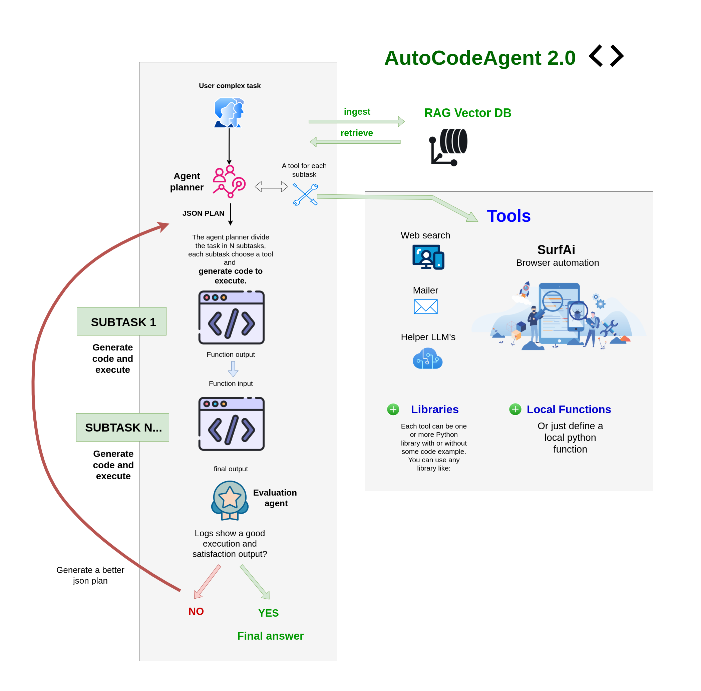

# AutoCodeAgent 2.0 with multi RAG Retrieval/Ingestion techniques - Version 2.0.1

## Introduction
Welcome to the project! This section provides a general overview of the project, its goals, and its main features.
[Go to Introduction](#introduction)

## Features
Here, the main features of the project are listed and described.
[Go to Features](#features)

## All Ways to Add Tools
This section explains the various methods available for adding tools to the project.
[Go to All Ways to Add Tools](#all-ways-to-add-tools)

## Video Demo
Explore the full potential of AutoCodeAgent by watching these demonstration videos.
[Go to Video Demo](#video-demo)

## Application Setup
Step-by-step guide to setting up the project for the first time.
[Go to Application Setup](#application-setup)

## Default Tools
Description of the tools that are included by default in the project.
[Go to Default Tools](#default-tools)

## NEW! Integration of SurfAi as an Automated Web Navigation Tool (local function type)
We have integrated SurfAi into our suite as a powerful automated web navigation tool. This enhancement enables seamless interaction with web pages, efficient extraction of data and images, and supports the resolution of more complex tasks through intelligent automation.
[Go to SurfAi Integration](#surfai-integration)

## All RAG Techniques at Your Fingertips, Each as a Tool
Overview of the different RAG techniques available and how to use them as tools.
[Go to All RAG Techniques](#all-rag-techniques)

### Simple RAG
Detailed description of the Simple RAG technique.
[Go to Simple RAG](#simple-rag)

### Hybrid Vector Graph RAG
Detailed description of the Hybrid Vector Graph RAG technique.
[Go to Hybrid Vector Graph RAG](#hybrid-vector-graph-rag)


## Introduction <a name="introduction"></a>
Welcome to the Advanced AI Code Agent project! This intelligent agent leverages cutting-edge AI techniques to automatically generate, execute, and refine Python code in a modular and iterative way. It is designed to break down complex tasks into manageable subtasks, generate precise code for each, and orchestrate their execution using a variety of tools and libraries.
The Advanced AI Code Agent is an AI-powered system that automates the process of decomposing complex problems, writing Python code, executing that code, and evaluating the results. It uses a combination of AI language models, dynamic code execution, and an evaluation loop to refine its approach until the task is successfully completed. This repository provides a robust framework that you can extend to solve a wide range of problems by simply defining new tasks and integrating appropriate tools.

AutoCodeAgent allows you to handle complex tasks such as:

- *"I want to review the picture on Wikipedia for three different actors. Use browser_navigation to visit each actor's Wikipedia page, please use your vision capability guess the actor's age in the picture. Your goal is to guess the actor's age in the picture. Then, create a summary when you compare the picture age with the actual actor's age. Once you have completed the report, send it by email to (your_email). The actors are: Brad Pitt Robert De Niro Marlon Rando. Good luck!"*

- *"Visit 4 different electronics e-commerce sites to get the average price of the top 3 search results for the query: iPhone 13 Pro. The websites are: https://www.bestbuy.com/, https://www.croma.com/, https://www.mediaworld.it/, https://www.boulanger.com/. Then, provide me with a price comparison report. If you find a currency other than the euro, search Google for the latest exchange rate and convert the prices. Finally, save the report in the simple rag database and send me the same report via email to (your_email)"*

- *"Go to LinkedIn Feed and log in using your email (your_email) and password (your_password). Scroll down to the first post and leave a comment that is both intelligent and contextually relevant, taking into account the text and image. Your comment must contain at least 40 words. Once you have posted your comment, email the execution result to (your_email)."*


AutoCodeAgent 2.0 introduces RAG (Retrieval-Augmented Generation) capabilities, empowering the system with multi RAG techniques, each having its own ingestion and retrieval tools. 
The system uses many persistent Database integrated in Docker, like Vector ChromaDB, Graph Neo4j, and Others.
The great potential of this agent lies in its ability to use many RAG techniques as tools for both ingestion and retrieval.
For example, to save a web search in the database, simply create the prompt specifying the tool, such as: search for the latest news on Elon Musk and save it in the database using the tool: "ingest_hybrid_vector_graph_rag_db"
or, find information on the latest Ferrari model in the database using the tool "retrieve_simple_rag"
With these enhancements, the agent can now:

- RAG Ingestion
Save structured or unstructured data into a database in a conversational manner, making it accessible for future tasks.
Dynamically analyze and preprocess data before ingestion, ensuring high compatibility with retrieval tools.

- RAG Retrieval
Efficiently retrieve relevant information from the database based on context, enabling informed decision-making and more accurate code generation.
Seamlessly integrate retrieved data into ongoing tasks, ensuring continuity and adaptability.
These features allow the agent to leverage previously ingested knowledge and improve task performance, particularly in scenarios requiring iterative learning or contextual awareness.


## Features <a name="features"></a>

### Task Decomposition: Automatically breaks down a complex main task into multiple smaller subtasks. Each subtask corresponds to a specific tool or function designed to handle a part of the problem, resulting in a clear and structured JSON plan.

### Dynamic Code Generation & Execution: 
For each subtask, the agent:
Generates Python code tailored to solve that specific subtask.
Executes the code to obtain outputs.
Feeds the output of one subtask as the input for the next, ensuring seamless data flow across the entire process.

### Flexible Tool Creation:
Library-Based Tools: Easily integrate Python libraries by specifying their names and usage examples. The agent can automatically generate code that leverages these libraries.
Custom Function Tools: Define specific functions as tools. The agent identifies these and avoids auto-generating code for them, ensuring custom implementations remain intact and reliable.

### Iterative Evaluation Loop:
A dedicated Evaluation Agent monitors execution logs, assesses whether the process ran successfully, and decides whether re-execution is necessary.
If errors or strange outputs are detected, the agent regenerates a new JSON plan with improved code and repeats the execution process.
The iterative loop continues until a satisfactory result is achieved or a maximum number of iterations is reached.

### Memory Logging & Error Handling:
Integrates a robust logging system to capture detailed execution logs. This allows for precise debugging and refinement of the agent's behavior.
Each subtask function includes error handling with try/except blocks to ensure graceful failure and informative logging, making the agent resilient to runtime issues.

### Modular and Extensible Design:
The framework encourages reusability and modularity by consolidating related operations within single functions when multiple subtasks require the same library. This maintains code efficiency and cleanliness.
Designed to integrate seamlessly with various Python libraries, allowing for flexible tool expansion without significant modifications to the core agent logic.

### Safe and Secure Execution:
Uses controlled namespaces and captures standard output to prevent unintended side effects during code execution.
Sanitizes outputs from AI model responses to ensure robust JSON parsing and prevent syntax issues in dynamically generated code.

### RAG retrieval / ingestion
- The agent now uses a vector database (ChromaDB) to store and retrieve information.
- Rag retrieval and Rag ingestion have been added as actual tools in code_agent.default_tools.py
- About RAG retrieval: always ensure to instruct the agent to acquire information from the database.
  Example prompt: "Retrieve information about Lamborghini from the database, translate it into German, and send it via email to devergo.sa@gmail.com"
- About RAG ingestion: always ensure to instruct the agent to ingest information into the database.
  Example prompt: "Search for information about the Ducati Monster on the web and save it in the database"
  Example prompt: "Save in the database the following information about the Ferrari F340: paste here the informations....."

### Persistent Database
- At Docker startup, all support databases for any RAG technique, including vector databases (ChromaDB) and graph databases (Neo4j), are automatically created.
- The database is stored in the container, so it is persistent and will be available even after the container is stopped.

### Here you can find a workflow that illustrates the agent's operation:


## Each tool can be added in different ways: <a name="all-ways-to-add-tools"></a>

1) **ONLY LIBRARY NAME**: specifying only the name of the Python library:
Ensure the library is listed in requirements.txt
```python
    {   
        "tool_name": "numpy",
        "lib_names":["numpy"]
    }
```

2) **LIBRARY NAME + INSTRUCTIONS + CODE EXAMPLE**: specifying a python library, providing a description, and a non-strict code example:
Ensure the library is listed in requirements.txt
```python
    {    
        "tool_name": "geopy",
        "lib_name": ["geopy"], 
        "instructions": "A library to get the coordinates of a given location.",
        "code_example": """
            
            def get_coordinates(previous_output):
            
                from geopy.geocoders import Nominatim
                updated_dict = previous_output.copy()

                user_agent = "my-app/1.0"
                location = updated_dict.get("location", "")
            
                geolocator = Nominatim(user_agent=user_agent)

                try: 
                    # Geocode the location
                    geo_location = geolocator.geocode(location)
                    
                    if geo_location:
                        updated_dict["coordinates"] = (geo_location.latitude, geo_location.longitude)
                    else:
                        updated_dict["coordinates"] = None
                    return updated_dict

                except Exception as error:
                    logger.error(f"Error retrieving coordinates: {error}")
                    return previous_output

        """
    }

```

3) **LIBRARIES + INSTRUCTIONS + STRICT CODE EXAMPLE**: defining a precise custom function associated with one or more libraries:
```python
    {
        "tool_name": "send_email",
        "lib_names": ["smtplib", "email"],
        "instructions": "Send an email to the user with the given email, subject and html content.",
        "use_exactly_code_example": True,
        "code_example": """
def send_email(previous_output, GMAILUSER: str = "your_email@gmail.com", PASSGMAILAPP: str = "your_password") -> dict:
    import smtplib
    from email.mime.text import MIMEText
    from email.mime.multipart import MIMEMultipart

    # Gmail credentials
    usermail = GMAILUSER
    passgmailapp = PASSGMAILAPP

    # SMTP server configuration
    smtp_server = "smtp.gmail.com"
    port = 587  # For TLS encryption

    try:
        updated_dict = previous_output.copy()

        # Create the email message
        message = MIMEMultipart()
        message["From"] = usermail
        message["To"] = updated_dict.get("email", "")
        message["Subject"] = updated_dict.get("subject", "")

        # Attach the HTML content
        html_content = updated_dict.get("html", "")
        if html_content:
            message.attach(MIMEText(html_content, "html"))

        # Establish connection to the SMTP server
        with smtplib.SMTP(smtp_server, port) as server:
            server.starttls()  # Secure the connection
            server.login(usermail, passgmailapp)  # Log in to the SMTP server
            
            # Send the email
            server.sendmail(usermail, updated_dict.get("email", ""), message.as_string())
            logger.info(f"Email sent to {updated_dict.get('email', '')} with subject {updated_dict.get('subject', '')}")

        updated_dict["info"] = "Email sent successfully"
        return updated_dict
    except Exception as error:
        logger.error(f"Error sending email: {error}")
        return previous_output
"""
    }
```

4) Add tools such as LLMs for support:
```python
    {
        "tool_name": "helper_model",
        "lib_names": ["models"],
        "instructions": "An LLM useful to elaborate any output from previous steps. Don't create loops, just use the LLM to elaborate the output for a single step.",
        "use_exactly_code_example": True,
        "code_example": """
def call_helper_model(previous_output):
    from models.models import call_model
    try:
        updated_dict = previous_output.copy()

        message = updated_dict.get('message', '')
        if len(message) > 350000:
            message = message[:350000]
        updated_dict['message'] = message
        
        prompt = f"here you describe how to elaborate the previous output: {updated_dict.get('message','')}"
        llm_response: str = call_model(
            chat_history=[{"role": "user", "content": prompt}],
            model="$TOOL_HELPER_MODEL"
        )
        updated_dict["elaborated_output"] = llm_response
        return updated_dict
    except Exception as e:
        logger.error(f"Error calling helper model: {e}")
        return previous_output
"""
    }
```

5) **ADD LOCAL FUNCTIONS**: adding a local function to the agent, we use this technique to add RAG retrieval and RAG ingestion as tools:
```python
    {
        "tool_name": "ingest_hybrid_vector_graph_rag",
        "lib_names": ["tools.rag.hybrid_vector_graph_rag"],
        "instructions": "This is an Hybrid Vector Graph RAG ingestion tool. Ingest the text into the vector and graph database.",
        "use_exactly_code_example": True,
        "code_example": """
def ingest_hybrid_vector_graph_rag_db(previous_output):
    from tools.rag.hybrid_vector_graph_rag.engine import HybridVectorGraphRag
    try:
        updated_dict = previous_output.copy()
        
        engine = HybridVectorGraphRag()
        text: str = updated_dict.get("text", "")
        ingest_result: dict = engine.ingest([text])
        updated_dict["ingest_result"] = str(ingest_result)
        return updated_dict
    except Exception as e:
        logger.error(f"Error ingesting texts: {e}")
        return previous_output
"""
    }
```

To add new tools, simply insert them into the tools array in app.py.
Some rules to follow:
- The tool name (tool_name) must be unique.
- Use exactly the same JSON structure you see, for example, for geopy.
- For the function, always use this schema:

```python
def function_name(previous_output):

    from library_name import method_name
    updated_dict = previous_output.copy()
    # some variables here

    try: 
        # add your logic here
        # remember to always update updated_dict based on what the function returns
        # for example: updated_dict["new_variable_1"] = "new_value_1"
        # for example: updated_dict["new_variable_2"] = "new_value_2"
        # always specify the type for the outputs of the library functions used, for example: answer: str = method_name(args)

        return updated_dict

    except Exception as error:
        logger.error(f"Error for the function_name: {function_name} : {error}")
        return previous_output
```

## Video Demo <a name="video-demo"></a>
Discover the capabilities of AutoCodeAgent with those videos:
[General Video Demo](https://youtu.be/T3Ej4-eeDag).
[Hybrid Vector Graph RAG Video Demo](https://youtu.be/a9Ul6CxYsFM).


## Application Setup <a name="application-setup"></a>
Follow the steps below to set up and run the pplication using Docker. This setup ensures that all necessary services are built and started correctly, with session management handled seamlessly via a Redis database.

### Prerequisites
- **Docker**: Ensure that Docker is installed on your system. You can download it from [here](https://www.docker.com/get-started).
- **Docker Compose**: Typically included with Docker Desktop installations. Verify by running `docker-compose --version`. 

### Steps to Initialize the Application

 1. Clone the repository:

```bash
git clone https://github.com/samugit83/AutoCodeAgent
```

2. Navigate to the project directory:
```bash
cd interactive-multiagent
```

3. Build the Docker image:
```bash
docker-compose build
```

4. Run the Docker container:
```bash
docker-compose up -d
```

5. Check the backend logs: 
```bash
docker logs -f flask_app
```

6. Access the AI Agent chat interface: 
```bash
http://localhost:5000  
```

- if you want to rebuild and restart the application:

```bash
docker-compose down
docker-compose build --no-cache
docker-compose up -d
docker logs -f flask_app  
```

7. Environment Variables:
Create a file named .env in the root folder and insert all the following variables to ensure the application functions correctly:

```bash
OPENAI_API_KEY=your_api_key
FLASK_PORT=5000 
CHROMA_DB_PATH=./tools/rag/database/chroma_db
NEO4J_URI=bolt://localhost:7687
NEO4J_USER=neo4j
NEO4J_PASSWORD=your_password 

SIMPLE_RAG_CHUNK_SIZE=1500  # chunk size for simple rag
SIMPLE_RAG_OVERLAP=200  # overlap for simple rag

HYBRID_VECTOR_GRAPH_RAG_CHUNK_SIZE=1500  # chunk size for hybrid vector graph rag
HYBRID_VECTOR_GRAPH_RAG_OVERLAP=200  # overlap for hybrid vector graph rag
HYBRID_VECTOR_GRAPH_RAG_SUMMARIZATION_GRAPH_NODE_LENGTH=100  # summarization graph node length for hybrid vector graph rag
HYBRID_VECTOR_GRAPH_RAG_SIMILARITY_RETRIEVE_THRESHOLD=0.9  # similarity retrieve threshold for hybrid vector graph rag
HYBRID_VECTOR_GRAPH_RAG_SIMILARITY_EDGE_THRESHOLD=0.9  # similarity edge threshold for hybrid vector graph rag
HYBRID_VECTOR_GRAPH_RAG_QUERY_MAX_DEPTH=3  # max depth for hybrid vector graph rag
HYBRID_VECTOR_GRAPH_RAG_QUERY_TOP_K=3  # top k for hybrid vector graph rag
HYBRID_VECTOR_GRAPH_RAG_QUERY_MAX_CONTEXT_LENGTH=10000  # max context length for hybrid vector graph rag

TOOL_HELPER_MODEL=gpt-4o  # tool helper model
JSON_PLAN_MODEL=gpt-4o  # json plan model
EVALUATION_MODEL=gpt-4o  # evaluation model
SURF_AI_JSON_TASK_MODEL=gpt-4o  # surf ai json task model, important: for surfAi you must use a multimodal modal with text + vision capabilities

SIMPLE_RAG_EMBEDDING_MODEL=text-embedding-ada-002  # simple rag embedding model
HYBRID_VECTOR_GRAPH_RAG_EMBEDDING_VECTOR_MODEL="text-embedding-ada-002"  # hybrid vector graph rag embedding vector model
HYBRID_VECTOR_GRAPH_RAG_SUMMARIZATION_GRAPH_NODE_MODEL="gpt-4o"  # hybrid vector graph rag summarization graph node model

```


## Default Tools <a name="default-tools"></a>
The default tools are pre-implemented and fully functional, supporting the agent in executing subtasks. These default tools are listed below and can be found in the file: 
/code_agent/default_tools.py

- browser_navigation
  - integration of SurfAi for web navigation, data and image extraction, with multimodal text + vision capabilities
- helper_model
  - An LLM useful for processing the output of a subtask
- ingest_simple_rag
  - A tool for ingesting text into a ChromaDB Vector database with simple RAG
- retrieve_simple_rag
  - A tool for retrieving the most similar documents to a query from a ChromaDB Vector database with simple RAG
- ingest_hybrid_vector_graph_rag
  - A tool for ingesting text into a Neo4j database with hybrid vector graph RAG
- retrieve_hybrid_vector_graph_rag
  - A tool for retrieving the most similar documents to a query from a Neo4j database with hybrid vector graph RAG
- search_web
  - A tool for searching information on the web
- send_email
  - A tool for sending an email


## SurfAi 🌐🤖 - now as a default tool! <a name="surfai-integration"></a>

**AI-Powered Web Automation Agent** - Version 1.1.0

SurfAi is an intelligent and lightweight web automation engine that harnesses AI to interpret natural language instructions and automate web interactions using Playwright. It seamlessly integrates large language model capabilities with browser automation to execute complex tasks.

The groundbreaking innovation lies in its integration as a tool within AutoCodeAgent, enabling the execution of even more sophisticated tasks. SurfAi allows users to navigate web pages, interact with them, extract information, and visually analyze images, ultimately delivering a structured output for the next tool in the complex task workflow.

## Video Demo 
Discover the capabilities of SurfAi:
[Task: Post on Linkedin](https://youtu.be/n2jnfNpV6BQ).
[Task: Job application on LinkedIn](https://youtu.be/T3Ej4-eeDag).
[Task: Add a new work experience on LinkedIn](https://youtu.be/hR73ftZ4t_4).
[Task: Search for an available hotel on Booking.com and get info](https://youtu.be/o5Gn-XVv_h8).

## Features ✨

- **AI-Driven Task Generation**: Converts natural language prompts into executable Playwright commands
- **Self-Correcting Workflow**: Dynamic task adjustment based on execution results and page context
- **Interactive Element Highlighting**: Visual numbering system for precise element targeting
- **Multi-Strategy Execution**: Automatic fallback commands for reliable task completion
- **Context-Aware Scraping**: Real-time page analysis with intelligent content truncation
- **Comprehensive Logging**: Detailed execution tracking with memory buffering
- **Data Extraction**: Extract data from the page and store it in the tasks to provide a final answer
- **Multi-Tab Navigation**: Navigate on multiple tabs and switch between them

If the tool is invoked, you can view the navigation by accessing:
```bash
http://localhost:6901/vnc.html
```


## All RAG Techniques at Your Fingertips, Each as a Tool <a name="all-rag-techniques"></a>

Welcome to the heart of AutoCodeAgent 2.0, where the power of Retrieval-Augmented Generation (RAG) is seamlessly integrated into your workflow. Imagine having a suite of advanced RAG techniques at your disposal, each designed to handle specific data retrieval and ingestion tasks with precision and efficiency. These techniques are not just abstract concepts—they are practical tools that you can invoke with a simple prompt, enabling the agent to interact with structured and unstructured data in ways that were previously unimaginable.

In this section, we dive into the diverse RAG techniques that AutoCodeAgent 2.0 offers, each tailored to address unique challenges in data processing and retrieval. Whether you're working with vector databases, graph databases, or a hybrid of both, these tools empower the agent to ingest, retrieve, and analyze data with unparalleled accuracy and speed. From simple RAG for straightforward tasks to the sophisticated Hybrid Vector Graph RAG for complex, multi-layered data relationships, every technique is designed to enhance the agent's capabilities and make your workflow more efficient.

Think of these RAG techniques as your personal data assistants, ready to fetch, store, and process information at your command. With AutoCodeAgent 2.0, you’re not just working with data—you’re orchestrating it. Let’s explore how each RAG technique can transform the way you interact with information, making your tasks smarter, faster, and more intuitive.

---

### Simple RAG <a name="simple-rag"></a>
Simple RAG is your go-to tool for straightforward data retrieval and ingestion tasks. It leverages vector embeddings to store and retrieve text chunks efficiently, making it ideal for scenarios where quick access to relevant information is crucial. Whether you're saving web search results or retrieving documents based on a query, Simple RAG ensures that your data is always within reach.

**Key Features:**
- **Efficient Text Chunking:** Breaks down large texts into manageable chunks for easy processing.
- **Vector Embeddings:** Converts text into numerical vectors, enabling fast and accurate similarity searches.
- **Seamless Integration:** Works seamlessly with ChromaDB, a vector database optimized for high-performance retrieval.

**Use Cases:**
- Saving web search results for future reference.
- Retrieving documents based on user queries.
- Enhancing the agent's ability to recall and utilize previously ingested data.

**Example Prompt:**
- *"Search for the latest news on AI advancements and save it in the database using the tool: `ingest_simple_rag`."*
- *"Retrieve information about climate change from the database using the tool: `retrieve_simple_rag`."*

---

### Hybrid Vector Graph RAG <a name="hybrid-vector-graph-rag"></a>
[Hybrid Vector Graph RAG Video Demo](https://youtu.be/a9Ul6CxYsFM).

Hybrid Vector Graph RAG takes data retrieval to the next level by combining the strengths of vector embeddings and graph databases. This technique not only stores text chunks as vectors but also captures the relationships between them in a graph structure. The result is a powerful tool that can navigate complex data relationships, making it perfect for tasks that require deep contextual understanding.

**Key Features:**
- **Graph-Based Relationships:** Captures and leverages relationships between text chunks using Neo4j, a leading graph database.
- **Summarization and Lemmatization:** Summarizes text chunks and reduces words to their base forms for consistent analysis.
- **Advanced Retrieval:** Uses Breadth-First Search (BFS) to explore and retrieve related information, ensuring comprehensive context for each query.

**Use Cases:**
- Building knowledge graphs from ingested data.
- Retrieving information with deep contextual relevance.
- Handling complex queries that require understanding of data relationships.

**Example Prompt:**
- *"Save the latest research papers on quantum computing in the database using the tool: `ingest_hybrid_vector_graph_rag`."*
- *"Find information about the connections between AI and healthcare using the tool: `retrieve_hybrid_vector_graph_rag`."*


**Bulk Ingestion:**
You can ingest a corpus by directly uploading files in txt or pdf format to the /tools/rag/hybrid_vector_graph_rag/corpus folder.
To start the batch processing, simply make an API call:
```bash
curl -X POST "http://localhost:5000/hybrid-vector-graph-rag-ingest-corpus"
```
The script will process the information in the files, transferring it to the vector and graph database.

**Neo4j Database Browser:**
Access the Neo4j database browser at http://localhost:7474/browser/ and run all the query to retrieve, delete or modify the data:
Some query examples:    
```bash
MATCH (n:Chunk) RETURN n LIMIT 200
```
```bash
MATCH (n:Chunk) DETACH DELETE n
```

### Here you can find a workflow that illustrates hybrid vector graph RAG ingestion and retrieval:


### Ingestion steps:

1. Start Ingestion: 
Initiates the ingestion process.

2. Split Texts into Chunks
Breaks down large pieces of text into smaller, manageable sections based on size limits. This makes processing easier and ensures that each segment can be effectively analyzed and stored without overwhelming the system.

3. Create Embeddings for Chunks
Converts each text chunk into a numerical format (embedding) that captures its meaning. These embeddings allow the system to understand and compare the content of different chunks efficiently.

4. Add Documents to ChromaDB
Stores the text chunks along with their embeddings and related information in ChromaDB, a specialized database optimized for handling and retrieving these vector representations quickly and accurately.

5. Summarize Each Chunk
Generates brief summaries of each text chunk using a language model. These summaries distill the main ideas, making it easier to grasp the content without reading the entire text.

6. Lemmatize Summaries
Simplifies the summaries by reducing words to their base forms (lemmas) using SpaCy. This standardization helps in maintaining consistency and improving the accuracy of text analysis.

7. Create Lemma Embeddings
Transforms the lemmatized summaries into numerical embeddings. These embeddings represent the core meaning of the summaries, facilitating efficient comparison and retrieval within the system.

8. Create Nodes in Neo4j
Inserts the summarized and lemmatized information, along with their embeddings and metadata, into Neo4j as nodes. This graph database structure allows for rich relationships and connections between different text chunks.

9. Create Similarity Edges
Establishes connections between similar text chunks based on the similarity of their embeddings. These relationships help in forming a network of related information, enhancing the system's ability to retrieve and relate relevant data.

10. End Ingestion
Concludes the ingestion process by finalizing all tasks and ensuring that all data is properly stored and connections are closed. It confirms that the data is ready for use in retrieval and analysis operations.


### Retrieval steps:

1. Start Retrieval
Initiates the retrieval process based on a user's question. This marks the beginning of the system's effort to find and compile relevant information to answer the query.

2. Embed User Query
Converts the user's question into a numerical vector (embedding) using a specialized embedding model. This transformation allows the system to understand the semantic meaning of the question and compare it effectively with stored data.

3. Query ChromaDB for Top_k Chunks
Retrieves the top k most similar text chunks from ChromaDB based on the query embedding. These chunks are the most relevant pieces of information that closely match the user's question.

4. Initialize BFS with Retrieved Chunks
Sets up a Breadth-First Search (BFS) starting with the chunks retrieved from ChromaDB to explore related information in Neo4j. BFS is a method for traversing or searching through the graph database to find additional relevant data.

5. Is Context Enough?
Checks if the currently gathered context is sufficient to answer the question by prompting a Language Model (LLM). This step determines whether the accumulated information provides a complete and accurate answer.

- Yes: Generate Final Answer Uses the accumulated context to formulate a concise answer to the user's question. The system synthesizes the information to provide a clear and direct response. Return Final Answer Outputs the generated answer to the user, delivering the final response based on the retrieved and processed data.
End Retrieval Marks the completion of the retrieval process, signaling that the system has successfully answered the user's question.

- No: Expand BFS to Next Depth Continues the BFS to explore more related chunks in Neo4j. This involves searching deeper into the graph database to find additional relevant information. Retrieve Neighbors Above Threshold Fetches neighboring chunks connected via SIMILAR_TO relationships with similarity scores above a defined threshold. Only connections that meet or exceed this similarity level are considered for further exploration. Update Visited and Queue Updates the set of visited chunks and adds new chunks to the BFS queue for further exploration. This ensures that the system efficiently tracks which pieces of information have been examined. Check Max Depth Ensures that the BFS does not exceed the maximum allowed depth. If the maximum depth is reached, the system proceeds to generate the final answer regardless of whether the context is fully sufficient. Loop Back to "Is Context Enough?" Re-evaluates if the newly accumulated context meets the sufficiency criteria. The system checks again whether the gathered information is adequate to answer the question.

6. Generate Final Answer
After gathering sufficient context or reaching the maximum BFS depth, the system compiles the final answer using the collected information. This step synthesizes all relevant data into a coherent response.

7. Return Final Answer
Delivers the generated answer to the user. The system presents the final response based on the comprehensive retrieval and analysis of the data.

8. End Retrieval
Concludes the retrieval process by finalizing all tasks and ensuring that all data is properly stored and connections are closed. It confirms that the system has successfully processed the user's query.

---

With these RAG techniques, AutoCodeAgent 2.0 transforms the way you interact with data, making it easier than ever to store, retrieve, and analyze information. Whether you're working on simple tasks or tackling complex data challenges, these tools are here to empower your workflow and unlock new possibilities.


## Contribution Guidelines 

We welcome contributions from the community! If you'd like to contribute, please follow these guidelines:

### How to Contribute
1. **Fork the Repository** – Click the "Fork" button at the top right of this page and clone the forked repository to your local machine.
2. **Create a Branch** – Use a descriptive branch name related to the feature or fix (e.g., `feature-new-component` or `fix-bug-123`).
3. **Make Your Changes** – Implement your feature, bug fix, or improvements, ensuring the code follows the project's coding style.
4. **Test Your Changes** – Run all tests to ensure that nothing is broken.
5. **Commit Your Changes** – Use clear and concise commit messages (e.g., `fix: resolve issue with user authentication`).
6. **Push to GitHub** – Push your branch to your forked repository.
7. **Submit a Pull Request (PR)** – Open a PR against the `main` or `develop` branch with a clear description of your changes.

### Contribution Guidelines
- Follow the coding standards and style used in the project.
- Keep PRs focused and small for easier review.
- Ensure new features or fixes are well-tested.
- Provide clear documentation if introducing a new feature.

By contributing, you agree that your changes will be licensed under the same license as the project.

Thank you for helping improve this project! 🚀
