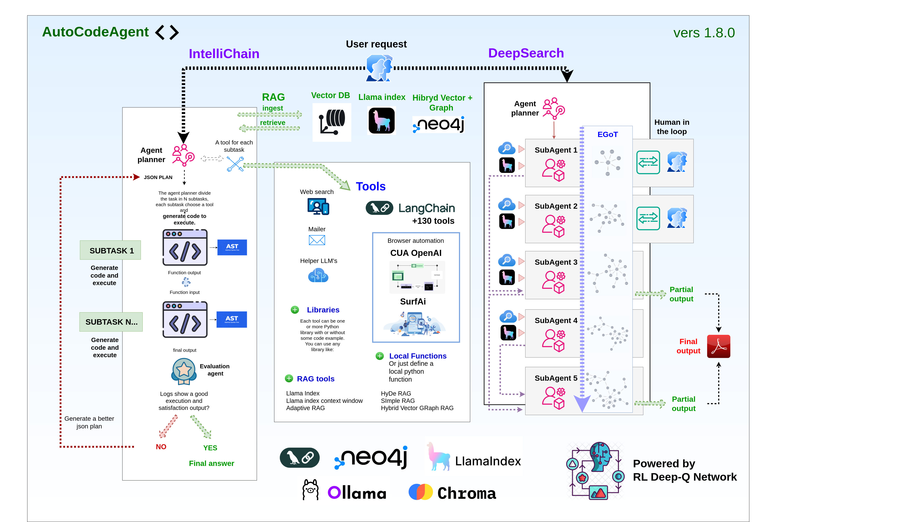

  

# AutoCodeAgent - An innovative dual-mode AI agent: IntelliChain + Deep Search


[One agent, two faces](#one-agent-two-faces)   
AutoCodeAgent fuses IntelliChain’s precise task decomposition with Deep Search’s autonomous web research, remarkably transforming complex challenges into innovative, actionable intelligence.
Discover how this unique Dual-Mode AI agent combines the power of code generation and Deep Search to tackle any challenge with precision and efficiency.

[Application Setup](#application-setup)  
Step-by-step guide to setting up the project for the first time.

## IntelliChain sections

[Introduction to IntelliChain](#introduction-to-intellichain)  
This section provides a general overview of IntelliChain mode, its goals, and its main features.

[Features](#features)  
Here, the main features of the project are listed and described.

[All Ways to Add Tools](#all-ways-to-add-tools)  
This section explains the various methods available for adding tools to the project.

[Video Demo](#video-demo)  
Explore the full potential of AutoCodeAgent by watching these demonstration videos.

[Parameters](#parameters)  
Description of the parameters to use in CodeAgent constructor. 

[Default Tools](#default-tools)  
Description of the tools that are included by default in the project.

[LangChain Tools](#langchain-tools)  
LangChain tools are integrated in the project, in this section you will learn how to add them easily.

[SurfAi Integration](#surfai-integration)  
NEW! Integration of SurfAi as an Automated Web Navigation Tool (local function type)
We have integrated SurfAi into our suite as a powerful automated web navigation tool. This enhancement enables seamless interaction with web pages, efficient extraction of data and images, and supports the resolution of more complex tasks through intelligent automation.

[All RAG Techniques](#all-rag-techniques)  
Overview of the different RAG techniques available and how to use them as tools.

[Simple RAG](#simple-rag)  
Detailed description of the Simple RAG technique.

[Hybrid Vector Graph RAG](#hybrid-vector-graph-rag)  
Detailed description of the Hybrid Vector Graph RAG technique.

[LlamaIndex RAG](#llama-index-rag)  
Discover how to use the LlamaIndex RAG.  


## Deep Search sections

[Introduction to Deep Search](#introduction-to-deep-search)  
Deep Search – Dive Deeper, Discover More.

[Multiagent collaborative chain](#multiagent-collaborative-chain)  
In these sections, you will understand how the agent planner generates a series of subtasks, each managed by a specialized agent interconnected with other agents in a collaborative network.

[Data Extraction](#data-extraction)  
Harnessing Real-Time Web Data and Structured Llama Index Local Knowledge.

[Evolving Graph of Thought (EGOT): An Innovative Reasoning System](#evolving-graph-of-thought-egot-an-innovative-reasoning-system)  
Dynamic Knowledge Representation for Adaptive Intelligence using an evolving graph of thought.

[Multi-Level Deep Search: 5 Layers of Search Depth](#multi-level-deep-search-5-layers-of-search-depth)  
A Progressive Approach to In-Depth Information Retrieval.

[Human-in-the-Loop: Collaborative Inquiry and Feedback](#human-in-the-loop-collaborative-inquiry-and-feedback)  
Augmenting AI with Human Expertise for Enhanced Intelligence.

[Video Demo And Prompts Examples](#video-demo-and-prompts-examples)   
Explore the full potential of Deep Search by watching these demonstration videos.

[Parameters and Configuration](#parameters-and-configuration)  
Description of the parameters to use in Deep Search constructor. 


## Application Setup
Follow the steps below to set up and run the application using Docker.  
This setup ensures that all necessary services are built and started correctly.

### Prerequisites
- **Docker**: Ensure that Docker is installed on your system. You can download it from [here](https://www.docker.com/get-started).
- **Docker Compose**: Typically included with Docker Desktop installations. Verify by running `docker-compose --version`. 

### Steps to Initialize the Application

 1. Clone the repository:

```bash
git clone https://github.com/samugit83/AutoCodeAgent2.0
```

2. Navigate to the project directory:
```bash
cd AutoCodeAgent2.0
```

3. Environment Variables:
Create a file named .env in the root folder and insert all the following variables to ensure the application functions correctly:

```bash
OPENAI_API_KEY=your_api_key  
FLASK_PORT=5000 
CHROMA_DB_PATH=./tools/rag/database/chroma_db
NEO4J_URI=bolt://neo4j:7687
NEO4J_USER=neo4j
NEO4J_PASSWORD=your_password 
REDIS_HOST=redis
REDIS_PORT=6379
REDIS_DB=0

SIMPLE_RAG_CHUNK_SIZE=1500  # chunk size for simple rag
SIMPLE_RAG_OVERLAP=200  # overlap for simple rag

HYBRID_VECTOR_GRAPH_RAG_CHUNK_SIZE=1500  # chunk size for hybrid vector graph rag
HYBRID_VECTOR_GRAPH_RAG_OVERLAP=200  # overlap for hybrid vector graph rag
HYBRID_VECTOR_GRAPH_RAG_SUMMARIZATION_GRAPH_NODE_LENGTH=100  # summarization graph node length for hybrid vector graph rag
HYBRID_VECTOR_GRAPH_RAG_SIMILARITY_RETRIEVE_THRESHOLD=0.9  # similarity retrieve threshold for hybrid vector graph rag
HYBRID_VECTOR_GRAPH_RAG_SIMILARITY_EDGE_THRESHOLD=0.9  # similarity edge threshold for hybrid vector graph rag
HYBRID_VECTOR_GRAPH_RAG_QUERY_MAX_DEPTH=3  # max depth for hybrid vector graph rag
HYBRID_VECTOR_GRAPH_RAG_QUERY_TOP_K=3  # top k for hybrid vector graph rag
HYBRID_VECTOR_GRAPH_RAG_QUERY_MAX_CONTEXT_LENGTH=10000  # max context length for hybrid vector graph rag

GMAILUSER=your_email@gmail.com
PASSGMAILAPP=your_password

TOOL_HELPER_MODEL=gpt-4o  # tool helper model
JSON_PLAN_MODEL=gpt-4o  # json plan model
EVALUATION_MODEL=gpt-4o  # evaluation model
SURF_AI_JSON_TASK_MODEL=gpt-4o  # surf ai json task model, important: for surfAi you must use a multimodal modal with text + vision capabilities
DEEP_SEARCH_MODEL=o3-mini  # deep search model

SIMPLE_RAG_EMBEDDING_MODEL=text-embedding-ada-002  # simple rag embedding model
HYBRID_VECTOR_GRAPH_RAG_EMBEDDING_VECTOR_MODEL=text-embedding-ada-002  # hybrid vector graph rag embedding vector model
HYBRID_VECTOR_GRAPH_RAG_SUMMARIZATION_GRAPH_NODE_MODEL=gpt-4o  # hybrid vector graph rag summarization graph node model

ELEVEN_API_KEY=API_KEY # elevenlabs api key for langchain tool
OPENWEATHERMAP_API_KEY=API_KEY # openweathermap api key for langchain tool
SERPAPI_API_KEY=API_KEY # serpapi api key for langchain tool and also deep search mode
SERPER_API_KEY=API_KEY # serpapi api key for deep search mode (optional, the script use serpapi by default)
```

4. Build the Docker image: 
```bash
docker-compose build
```

5. Run the Docker container:
```bash
docker-compose up -d
```

6. Check the backend logs: 
```bash
docker logs -f flask_app 
```
If you want to rebuild and restart the application:   
```bash
docker-compose down 
docker-compose build --no-cache
docker-compose up -d
docker logs -f flask_app    
```  
Is a good idea to always check docker space usage:
```bash
docker system df
```

7. Access the AI Agent chat interface: 
```bash
http://localhost:5000  

```
8. To view the automated browser sessions (powered by SurfAi), open:
```bash
http://localhost:6901/vnc.html
```
9. To explore and interact with the Neo4j graph database, visit:
```bash
http://localhost:7474/browser/
``` 

### Backend entry point
The backend logic is managed by a Flask application. The main Flask app is located at:  
```bash
/app.py
```  
This file orchestrates the interaction between the AI agent, tool execution, and the integration of various services (like Neo4j, Redis, and Docker containers).

### Frontend chat interface
The frontend static files (HTML, CSS, JavaScript, and images) reside in the folder:
```bash
/static
``` 
These files serve the user interface for the AI chat and related functionalities.


## One agent, two faces
AutoCodeAgent is a unique AI agent that comes with two complementary modes.

With IntelliChain, AutoCodeAgent deconstructs complex tasks into manageable sub-tasks, dynamically generating and executing precise Python code at every step. It employs modular workflows and integrates specialized tools—including various RAG techniques—to retrieve, process, and analyze information from persistent databases. This structured approach ensures robust, secure, and highly customizable task management, perfect for scenarios demanding clarity and precision.

In parallel, Deep Search empowers the agent with an autonomous, in-depth web research capability. Powered by an advanced model optimized for browsing and data analysis, Deep Search can independently explore, interpret, and synthesize data from hundreds of online sources—including texts, images, and PDFs—to produce comprehensive reports akin to those crafted by a seasoned research analyst. This modality dramatically condenses what would normally take hours of human effort into minutes, pushing the boundaries of automated intelligence.

Together, these two modes enable AutoCodeAgent to tackle any challenge by transforming complex data and extensive research into innovative, complete solutions. Whether managing internal tasks with precision through IntelliChain or scouring the digital landscape for actionable insights with Deep Search, AutoCodeAgent stands at the forefront of AI-powered problem solving, marking a significant step toward the realization of true artificial general intelligence (AGI).


# IntelliChain

## Introduction to IntelliChain
Welcome to the AutoCodeAgent IntelliChain Mode! This intelligent agent leverages cutting-edge AI techniques to automatically generate, execute, and refine Python code in a modular and iterative way. It is designed to break down complex tasks into manageable subtasks, generate precise code for each, and orchestrate their execution using a variety of tools and libraries.
The Advanced AI Code Agent is an AI-powered system that automates the process of decomposing complex problems, writing Python code, executing that code, and evaluating the results. It uses a combination of AI language models, dynamic code execution, and an evaluation loop to refine its approach until the task is successfully completed. This repository provides a robust framework that you can extend to solve a wide range of problems by simply defining new tasks and integrating appropriate tools.

IntelliChain allows you to handle complex tasks such as:

- *"I want to review the picture on Wikipedia for three different actors. Use browser_navigation to visit each actor's Wikipedia page, please use your vision capability guess the actor's age in the picture. Your goal is to guess the actor's age in the picture. Then, create a summary when you compare the picture age with the actual actor's age. Once you have completed the report, send it by email to (your_email). The actors are: Brad Pitt Robert De Niro Marlon Rando. Good luck!"*

- *"Navigate with browser different electronics e-commerce sites to get the average price of the top 3 search results for the query: iPhone 13 Pro. The websites are: https://www.bestbuy.com/, https://www.croma.com/, https://www.mediaworld.it/, https://www.boulanger.com/. Then, provide me with a price comparison report. If you find a currency other than the euro, search Google for the latest exchange rate and convert the prices. Finally, save the report in the llama index database and send me the same report via email to (your_email)"*

- *"Go to LinkedIn Feed and log in using your email (your_email) and password (your_password). Scroll down to the first post and leave a comment that is both intelligent and contextually relevant, taking into account the text and image. Your comment must contain at least 40 words. Once you have posted your comment, email the execution result to (your_email)."*

- *"Please visit Booking.com and search for a Hotel in Milan that is available from June 1st to June 10th. Extract the name and price of the first hotel in the result. Then save it on simple rag database, send an email to (your_email) with the hotel's name and price."*

- *"Calculate the area of the triangle formed by Paris, Moscow, and Rome in square kilometers, and send me an email at your_email@gmail.com with the coordinates of the cities and the calculated area."*

- *"Search for the latest news about Open AI, summarize it and send me an email at your_email@gmail.com with the summary."*

- *"Search for the latest articles on cybersecurity, extract full-page content along with any notable images and captions using your web search and browser navigation tools, compile everything into an HTML report, and send it via email to my team at your_email@gmail.com with the subject 'Cybersecurity Trends Update'."*

- *"Search for the latest news about the latest Ferrari model, summarize it, and save it in the LlamaIndex database. After that, make 3 different queries on the database to check if the information was stored correctly. Finally, send me a report by email to your_email@gmail.com"*


AutoCodeAgent introduces RAG (Retrieval-Augmented Generation) capabilities, empowering the system with multi RAG techniques, each having its own ingestion and retrieval tools. 
The system uses many persistent Database integrated in Docker, like Vector ChromaDB, Graph Neo4j, and Others.
The great potential of this agent lies in its ability to use many RAG techniques as tools for both ingestion and retrieval.
For example, to save a web search in the database, simply create the prompt specifying the tool, such as: search for the latest news on Elon Musk and save it in the database using the tool: "ingest_hybrid_vector_graph_rag_db"
or, find information on the latest Ferrari model in the database using the tool "retrieve_simple_rag"
With these enhancements, the agent can now:

- RAG Ingestion
Save structured or unstructured data into a database in a conversational manner, making it accessible for future tasks.
Dynamically analyze and preprocess data before ingestion, ensuring high compatibility with retrieval tools.

- RAG Retrieval
Efficiently retrieve relevant information from the database based on context, enabling informed decision-making and more accurate code generation.
Seamlessly integrate retrieved data into ongoing tasks, ensuring continuity and adaptability.
These features allow the agent to leverage previously ingested knowledge and improve task performance, particularly in scenarios requiring iterative learning or contextual awareness.


## Features

### Task Decomposition: 
Automatically breaks down a complex main task into multiple smaller subtasks. Each subtask corresponds to a specific tool or function designed to handle a part of the problem, resulting in a clear and structured JSON plan.

### Dynamic Code Generation & Execution: 
For each subtask, the agent:
Generates Python code tailored to solve that specific subtask.
Executes the code to obtain outputs.
Feeds the output of one subtask as the input for the next, ensuring seamless data flow across the entire process.

### Flexible Tool Creation:
Library-Based Tools: Easily integrate Python libraries by specifying their names and usage examples. The agent can automatically generate code that leverages these libraries.
Custom Function Tools: Define specific functions as tools. The agent identifies these and avoids auto-generating code for them, ensuring custom implementations remain intact and reliable.

### LangChain Tools:
We have now integrated LangChain's toolbox, providing direct access to over 130 pre-built tools simply by specifying the tool name.  
This powerful integration streamlines the process of incorporating new functionalities into your projects.

### Iterative Evaluation Loop:
A dedicated Evaluation Agent monitors execution logs, assesses success, and, if necessary, re-plans or regenerates subtasks until a satisfactory result is achieved.

### Memory Logging & Error Handling:
Integrates a robust logging system to capture detailed execution logs. This allows for precise debugging and refinement of the agent's behavior.
Each subtask function includes error handling with try/except blocks to ensure graceful failure and informative logging, making the agent resilient to runtime issues.

### Modular and Extensible Design:
The framework encourages reusability and modularity by consolidating related operations within single functions when multiple subtasks require the same library. This maintains code efficiency and cleanliness.
Designed to integrate seamlessly with various Python libraries, allowing for flexible tool expansion without significant modifications to the core agent logic.

### Safe and Secure Execution:
Uses controlled namespaces and captures standard output to prevent unintended side effects.

### Python Function Validation & Task Regeneration:
A function validator inspects each subtask’s code (via AST analysis) for syntax, dangerous constructs, parameter correctness, allowed libraries and other issues *before execution*. If validation or execution errors occur, the agent automatically regenerates the subtask to ensure successful task completion.

### RAG retrieval / ingestion
- The agent now uses a vector database (ChromaDB) to store and retrieve information.
- Rag retrieval and Rag ingestion have been added as actual tools in code_agent.tool_generator.py
- About RAG retrieval: always ensure to instruct the agent to acquire information from the database.
  Example prompt: "Retrieve information about Lamborghini from the database, translate it into German, and send it via email to devergo.sa@gmail.com"
- About RAG ingestion: always ensure to instruct the agent to ingest information into the database.
  Example prompt: "Search for information about the Ducati Monster on the web and save it in the database"
  Example prompt: "Save in the database the following information about the Ferrari F340: paste here the informations....."

### Persistent Database
- At Docker startup, all support databases for any RAG technique, including vector databases (ChromaDB) and graph databases (Neo4j), are automatically created.
- The database is stored in the container, so it is persistent and will be available even after the container is stopped.


## All Ways to Add Custom Tools
In addition to the default tools, users can create custom tools by describing the function and specifying the libraries to be used.
There are several ways to create custom tools:

1) **ONLY LIBRARY NAME**:  
specifying only the name of the Python library:  
Ensure the library is listed in requirements.txt
```python
    {   
        "tool_name": "numpy",
        "lib_names":["numpy"],
        "type": "standard_custom"
    }
```

2) **LIBRARY NAME + INSTRUCTIONS + CODE EXAMPLE**:  
specifying a python library, providing a description, and a non-strict code example:
Ensure the library is listed in requirements.txt
```python
    {    
        "tool_name": "geopy",
        "lib_name": ["geopy"], 
        "type": "standard_custom",
        "instructions": "A library to get the coordinates of a given location.",
        "code_example": """
            
            def get_coordinates(previous_output):
            
                from geopy.geocoders import Nominatim
                updated_dict = previous_output.copy()

                user_agent = "my-app/1.0"
                location = updated_dict.get("location", "")
            
                geolocator = Nominatim(user_agent=user_agent)

                try: 
                    # Geocode the location
                    geo_location = geolocator.geocode(location)
                    
                    if geo_location:
                        updated_dict["coordinates"] = (geo_location.latitude, geo_location.longitude)
                    else:
                        updated_dict["coordinates"] = None
                    return updated_dict

                except Exception as error:
                    logger.error(f"Error retrieving coordinates: {error}")
                    return previous_output

        """
    }

```

3) **LIBRARIES + INSTRUCTIONS + STRICT CODE EXAMPLE**:   
defining a precise custom function associated with one or more libraries:  
By adding use_exactly_code_example: True, the code will be executed exactly as written, without any modifications. In the absence of this parameter, the code will be modified by the agent based on the task requested by the user. The second solution is more versatile but should only be applied to functions that do not require code modification.
If the function you add is already complex and very specific with possible critical issues, it is recommended to use the use_exactly_code_example: True mode.
```python
    {
        "tool_name": "send_email",
        "lib_names": ["smtplib", "email"],
        "type": "standard_custom",
        "instructions": "Send an email to the user with the given email, subject and html content.",
        "use_exactly_code_example": True,
        "code_example": """
def send_email(previous_output, GMAILUSER: str = "your_email@gmail.com", PASSGMAILAPP: str = "your_password") -> dict:
    import smtplib
    from email.mime.text import MIMEText
    from email.mime.multipart import MIMEMultipart

    # Gmail credentials
    usermail = GMAILUSER
    passgmailapp = PASSGMAILAPP

    # SMTP server configuration
    smtp_server = "smtp.gmail.com"
    port = 587  # For TLS encryption

    try:
        updated_dict = previous_output.copy()

        # Create the email message
        message = MIMEMultipart()
        message["From"] = usermail
        message["To"] = updated_dict.get("email", "")
        message["Subject"] = updated_dict.get("subject", "")

        # Attach the HTML content
        html_content = updated_dict.get("html", "")
        if html_content:
            message.attach(MIMEText(html_content, "html"))

        # Establish connection to the SMTP server
        with smtplib.SMTP(smtp_server, port) as server:
            server.starttls()  # Secure the connection
            server.login(usermail, passgmailapp)  # Log in to the SMTP server
            
            # Send the email
            server.sendmail(usermail, updated_dict.get("email", ""), message.as_string())
            logger.info(f"Email sent to {updated_dict.get('email', '')} with subject {updated_dict.get('subject', '')}")

        updated_dict["info"] = "Email sent successfully"
        return updated_dict
    except Exception as error:
        logger.error(f"Error sending email: {error}")
        return previous_output
"""
    }
```

4) Add tools such as LLMs for support:  
```python
    {
        "tool_name": "helper_model",
        "lib_names": ["models"],
        "type": "standard_custom",
        "instructions": "An LLM useful to elaborate any output from previous steps. Don't create loops, just use the LLM to elaborate the output for a single step.",
        "use_exactly_code_example": True,
        "code_example": """
def call_helper_model(previous_output):
    from models.models import call_model
    try:
        updated_dict = previous_output.copy()

        message = updated_dict.get('message', '')
        if len(message) > 350000:
            message = message[:350000]
        updated_dict['message'] = message
        
        prompt = f"here you describe how to elaborate the previous output: {updated_dict.get('message','')}"
        llm_response: str = call_model(
            chat_history=[{"role": "user", "content": prompt}],
            model="$TOOL_HELPER_MODEL"
        )
        updated_dict["elaborated_output"] = llm_response
        return updated_dict
    except Exception as e:
        logger.error(f"Error calling helper model: {e}")
        return previous_output
"""
    }
```

5) **ADD LOCAL FUNCTIONS**:  
adding a local function to the agent, we use this technique to add RAG retrieval and RAG ingestion as tools:  
```python
    {
        "tool_name": "ingest_hybrid_vector_graph_rag",
        "lib_names": ["tools.rag.hybrid_vector_graph_rag"],
        "type": "standard_custom",
        "instructions": "This is an Hybrid Vector Graph RAG ingestion tool. Ingest the text into the vector and graph database.",
        "use_exactly_code_example": True,
        "code_example": """
def ingest_hybrid_vector_graph_rag_db(previous_output):
    from tools.rag.hybrid_vector_graph_rag.engine import HybridVectorGraphRag
    try:
        updated_dict = previous_output.copy()
        
        engine = HybridVectorGraphRag()
        text: str = updated_dict.get("text", "")
        ingest_result: dict = engine.ingest([text])
        updated_dict["ingest_result"] = str(ingest_result)
        return updated_dict
    except Exception as e:
        logger.error(f"Error ingesting texts: {e}")
        return previous_output
"""
    }
```

To add new tools, simply insert them into the tools array in app.py.
Some rules to follow:
- The tool name (tool_name) must be unique.
- Use exactly the same JSON structure you see, for example, for geopy.
- Add default parameters in the function parameters only if you need fixed values to use in the function
- Add the type "standard_custom"
- Always use typing for all variables that interact with updated_dict, both in get and set, for example:
```python
    # set
    new_variable_1: str = "new_value_1"
    updated_dict["new_variable_1"] = new_variable_1

    # get
    new_variable_2: str = updated_dict.get("new_variable_1", "")
```
- For the function, always use this schema:
```python
def function_name(previous_output):

    from library_name import method_name
    updated_dict = previous_output.copy()
    # some variables here

    try: 
        # add your logic here
        # remember to always update updated_dict based on what the function returns
        # for example: updated_dict["new_variable_1"] = "new_value_1"
        # for example: updated_dict["new_variable_2"] = "new_value_2"
        # always specify the type for the outputs of the library functions used, for example: answer: str = method_name(args)

        return updated_dict

    except Exception as error:
        logger.error(f"Error for the function_name: {function_name} : {error}")
        return previous_output
```

## Video Demo
Discover the capabilities of AutoCodeAgent with those videos:<br>
[General Video Demo](https://youtu.be/T3Ej4-eeDag).<br>
[Project explanation Video Demo](https://youtu.be/4XGYf0ePSUY).<br>
[Hybrid Vector Graph RAG Video Demo](https://youtu.be/a9Ul6CxYsFM).<br>
[Integration with SurfAi Video Demo 1](https://youtu.be/b5OPk7-FPrk).<br>
[Integration with SurfAi Video Demo 2](https://youtu.be/zpTthh2wKds).<br>
[LangChain Toolbox Video Demo](https://youtu.be/sUKiN_qp750).<br>


## Parameters
**chat_history**: list of dictionaries, each containing a message history. 
```json
{
    "role": "user" | "assistant",
    "content": "message content"
}
```
**tools**: list of dictionaries, each containing a custom tool defined by the user.
**use_default_tools**: boolean, if True, the default tools will be included in the list of tools.
```python
code_agent = CodeAgent(
    chat_history=chat_history,
    tools=tools,
    use_default_tools=True
)
```

## Default Tools
The default tools are pre-implemented and fully functional, supporting the agent in executing subtasks. 
These default tools are listed below and can be found in the file: 
/code_agent/default_tools.py

- browser_navigation
  - integration of SurfAi for web navigation, data and image extraction, with multimodal text + vision capabilities
- helper_model
  - An LLM useful for processing the output of a subtask
- ingest_simple_rag
  - A tool for ingesting text into a ChromaDB Vector database with simple RAG
- retrieve_simple_rag
  - A tool for retrieving the most similar documents to a query from a ChromaDB Vector database with simple RAG
- ingest_llama_index
  - A tool for ingesting text into a LlamaIndex vector database
- retrieve_llama_index
  - A tool for retrieving the most similar documents to a query from a LlamaIndex vector database
- ingest_hybrid_vector_graph_rag
  - A tool for ingesting text into a Neo4j database with hybrid vector graph RAG
- retrieve_hybrid_vector_graph_rag
  - A tool for retrieving the most similar documents to a query from a Neo4j database with hybrid vector graph RAG
- search_web
  - A tool for searching information on the web
- send_email
  - A tool for sending an email

To include the default tools in the list of tools, set the parameter use_default_tools to True in the CodeAgent constructor.


## SurfAi Integration  
🌐🤖 **AI-Powered Web Automation Agent**

SurfAi is an intelligent and lightweight web automation engine that harnesses AI to interpret natural language instructions and automate web interactions using Playwright. It seamlessly integrates large language model capabilities with browser automation to execute complex tasks.

The groundbreaking innovation lies in its integration as a tool within AutoCodeAgent, enabling the execution of even more sophisticated tasks. SurfAi allows users to navigate web pages, interact with them, extract information, and visually analyze images, ultimately delivering a structured output for the next tool in the complex task workflow.

## Video Demo 
Discover the capabilities of SurfAi:  
[Task: Post on Linkedin](https://youtu.be/n2jnfNpV6BQ)  
[Task: Job application on LinkedIn](https://youtu.be/T3Ej4-eeDag)  
[Task: Add a new work experience on LinkedIn](https://youtu.be/hR73ftZ4t_4)  
[Task: Search for an available hotel on Booking.com and get info](https://youtu.be/o5Gn-XVv_h8)  

## Features ✨  
- **AI-Driven Task Generation**: Converts natural language prompts into executable Playwright commands
- **Self-Correcting Workflow**: Dynamic task adjustment based on execution results and page context
- **Interactive Element Highlighting**: Visual numbering system for precise element targeting
- **Multi-Strategy Execution**: Automatic fallback commands for reliable task completion
- **Context-Aware Scraping**: Real-time page analysis with intelligent content truncation
- **Comprehensive Logging**: Detailed execution tracking with memory buffering
- **Data Extraction**: Extract data from the page and store it in the tasks to provide a final answer
- **Multi-Tab Navigation**: Navigate on multiple tabs and switch between them

If the tool is invoked, you can view the navigation by accessing:
```bash
http://localhost:6901/vnc.html
```
You can find the screenshots generated during navigation at the following path: /tools/surf_ai/screenshots  


## LangChain Tools

We have now integrated LangChain's toolbox, providing direct access to over 130 pre-built tools simply by specifying the tool name.  
This powerful integration streamlines the process of incorporating new functionalities into your projects.

### How to Add LangChain Tools

To add a LangChain tool, include an object with the following attributes in the initial tools array (alongside your `standard_custom` tools):

```json
{
  "langchain_tool_name": "serpapi",
  "type": "langchain_tool",
  "additional_parameters": {
    "param_a": "param_a_value"
  }
}
```
- **langchain_tool_name**: Must exactly match the tool name as specified in the [LangChain Tools Documentation](https://python.langchain.com/docs/integrations/tools/).
- **type**: Should always be set to langchain_tool.
- **additional_parameters**: Contains any extra parameters required by the specific tool (for example, an API key). Although you can provide parameters here, it is recommended to store sensitive information like API keys in the .env file based on the tool's requirements.

### Important Considerations
- **Additional Libraries**: Some LangChain tools require extra libraries (e.g., elevenlabs, google-serp-api). Consult the LangChain Tools Documentation for details on which libraries to install, the necessary additional parameters, and the required environment variables.
- **Requirements Update**: When integrating a new LangChain tool that requires extra libraries, add these libraries to your requirements.txt. After updating, you must rebuild the Docker image and restart the container from scratch. Please refer to the Application Setup section for instructions on restarting Docker.

LangChain tools are extremely powerful for tackling complex tasks. For instance, consider a prompt that leverages the combined capabilities of different tools:

**Example Prompt:**

> *Generate a single audio file simulating a TV host presenting weather forecasts for the cities of Rome, Florence, and Venice. The script should include segments in English, Italian, and French, in that order, and consist solely of spoken text intended for playback.*

In this example, the system would:
1. Use **openweathermap-api** to fetch the weather forecasts.
2. Employ **helper_model** to construct a script that seamlessly transitions between English, Italian, and French.
3. Utilize **eleven_labs_text2speech** to convert the script into a cohesive audio file, perfect for a TV broadcast simulation.

This demonstrates the flexibility and strength of LangChain's integration capabilities in orchestrating multiple tools to achieve a complex, multi-step task.


## All Rag Techniques

Welcome to the heart of AutoCodeAgent 2.0, where the power of Retrieval-Augmented Generation (RAG) is seamlessly integrated into your workflow. Imagine having a suite of advanced RAG techniques at your disposal, each designed to handle specific data retrieval and ingestion tasks with precision and efficiency. These techniques are not just abstract concepts—they are practical tools that you can invoke with a simple prompt, enabling the agent to interact with structured and unstructured data in ways that were previously unimaginable.

In this section, we dive into the diverse RAG techniques that AutoCodeAgent 2.0 offers, each tailored to address unique challenges in data processing and retrieval. Whether you're working with vector databases, graph databases, or a hybrid of both, these tools empower the agent to ingest, retrieve, and analyze data with unparalleled accuracy and speed. From simple RAG for straightforward tasks to the sophisticated Hybrid Vector Graph RAG for complex, multi-layered data relationships, every technique is designed to enhance the agent's capabilities and make your workflow more efficient.

Think of these RAG techniques as your personal data assistants, ready to fetch, store, and process information at your command. With AutoCodeAgent 2.0, you’re not just working with data—you’re orchestrating it. Let’s explore how each RAG technique can transform the way you interact with information, making your tasks smarter, faster, and more intuitive.


### Simple RAG
Simple RAG is your go-to tool for straightforward data retrieval and ingestion tasks. It leverages vector embeddings to store and retrieve text chunks efficiently, making it ideal for scenarios where quick access to relevant information is crucial. Whether you're saving web search results or retrieving documents based on a query, Simple RAG ensures that your data is always within reach.

**Key Features:**
- **Efficient Text Chunking:** Breaks down large texts into manageable chunks for easy processing.
- **Vector Embeddings:** Converts text into numerical vectors, enabling fast and accurate similarity searches.
- **Seamless Integration:** Works seamlessly with ChromaDB, a vector database optimized for high-performance retrieval.

**Use Cases:**
- Saving web search results for future reference.
- Retrieving documents based on user queries.
- Enhancing the agent's ability to recall and utilize previously ingested data.

**Example Prompt:**
- *"Search for the latest news on AI advancements and save it in the database using the tool: `ingest_simple_rag`."*
- *"Retrieve information about climate change from the database using the tool: `retrieve_simple_rag`."*


### Hybrid Vector Graph RAG
[Hybrid Vector Graph RAG Video Demo](https://youtu.be/a9Ul6CxYsFM).

Hybrid Vector Graph RAG takes data retrieval to the next level by combining the strengths of vector embeddings and graph databases. This technique not only stores text chunks as vectors but also captures the relationships between them in a graph structure. The result is a powerful tool that can navigate complex data relationships, making it perfect for tasks that require deep contextual understanding.

**Key Features:**
- **Graph-Based Relationships:** Captures and leverages relationships between text chunks using Neo4j, a leading graph database.
- **Summarization and Lemmatization:** Summarizes text chunks and reduces words to their base forms for consistent analysis.
- **Advanced Retrieval:** Uses Breadth-First Search (BFS) to explore and retrieve related information, ensuring comprehensive context for each query.

**Use Cases:**
- Building knowledge graphs from ingested data.
- Retrieving information with deep contextual relevance.
- Handling complex queries that require understanding of data relationships.

**Example Prompt:**
- *"Save the latest research papers on quantum computing in the database using the tool: `ingest_hybrid_vector_graph_rag`."*
- *"Find information about the connections between AI and healthcare using the tool: `retrieve_hybrid_vector_graph_rag`."*


**Bulk Ingestion:**
You can ingest a corpus by directly uploading files in txt or pdf format to the /tools/rag/hybrid_vector_graph_rag/corpus folder.
To start the batch processing, simply make an API call:
```bash
curl -X POST "http://localhost:5000/hybrid-vector-graph-rag-ingest-corpus"
```
The script will process the information in the files, transferring it to the vector and graph database.

**Neo4j Database Browser:**
Access the Neo4j database browser at http://localhost:7474/browser/ and run all the query to retrieve, delete or modify the data:
Some query examples:    
```bash
MATCH (n:Chunk) RETURN n LIMIT 200
```
```bash
MATCH (n:Chunk) DETACH DELETE n
```

### Here you can find a workflow that illustrates hybrid vector graph RAG ingestion and retrieval:


### Ingestion steps:

1. Start Ingestion: 
Initiates the ingestion process.

2. Split Texts into Chunks
Breaks down large pieces of text into smaller, manageable sections based on size limits. This makes processing easier and ensures that each segment can be effectively analyzed and stored without overwhelming the system.

3. Create Embeddings for Chunks
Converts each text chunk into a numerical format (embedding) that captures its meaning. These embeddings allow the system to understand and compare the content of different chunks efficiently.

4. Add Documents to ChromaDB
Stores the text chunks along with their embeddings and related information in ChromaDB, a specialized database optimized for handling and retrieving these vector representations quickly and accurately.

5. Summarize Each Chunk
Generates brief summaries of each text chunk using a language model. These summaries distill the main ideas, making it easier to grasp the content without reading the entire text.

6. Lemmatize Summaries
Simplifies the summaries by reducing words to their base forms (lemmas) using SpaCy. This standardization helps in maintaining consistency and improving the accuracy of text analysis.

7. Create Lemma Embeddings
Transforms the lemmatized summaries into numerical embeddings. These embeddings represent the core meaning of the summaries, facilitating efficient comparison and retrieval within the system.

8. Create Nodes in Neo4j
Inserts the summarized and lemmatized information, along with their embeddings and metadata, into Neo4j as nodes. This graph database structure allows for rich relationships and connections between different text chunks.

9. Create Similarity Edges
Establishes connections between similar text chunks based on the similarity of their embeddings. These relationships help in forming a network of related information, enhancing the system's ability to retrieve and relate relevant data.

10. End Ingestion
Concludes the ingestion process by finalizing all tasks and ensuring that all data is properly stored and connections are closed. It confirms that the data is ready for use in retrieval and analysis operations.


### Retrieval steps:

1. Start Retrieval
Initiates the retrieval process based on a user's question. This marks the beginning of the system's effort to find and compile relevant information to answer the query.

2. Embed User Query
Converts the user's question into a numerical vector (embedding) using a specialized embedding model. This transformation allows the system to understand the semantic meaning of the question and compare it effectively with stored data.

3. Query ChromaDB for Top_k Chunks
Retrieves the top k most similar text chunks from ChromaDB based on the query embedding. These chunks are the most relevant pieces of information that closely match the user's question.

4. Initialize BFS with Retrieved Chunks
Sets up a Breadth-First Search (BFS) starting with the chunks retrieved from ChromaDB to explore related information in Neo4j. BFS is a method for traversing or searching through the graph database to find additional relevant data.

5. Is Context Enough?
Checks if the currently gathered context is sufficient to answer the question by prompting a Language Model (LLM). This step determines whether the accumulated information provides a complete and accurate answer.

- Yes: Generate Final Answer Uses the accumulated context to formulate a concise answer to the user's question. The system synthesizes the information to provide a clear and direct response. Return Final Answer Outputs the generated answer to the user, delivering the final response based on the retrieved and processed data.
End Retrieval Marks the completion of the retrieval process, signaling that the system has successfully answered the user's question.

- No: Expand BFS to Next Depth Continues the BFS to explore more related chunks in Neo4j. This involves searching deeper into the graph database to find additional relevant information. Retrieve Neighbors Above Threshold Fetches neighboring chunks connected via SIMILAR_TO relationships with similarity scores above a defined threshold. Only connections that meet or exceed this similarity level are considered for further exploration. Update Visited and Queue Updates the set of visited chunks and adds new chunks to the BFS queue for further exploration. This ensures that the system efficiently tracks which pieces of information have been examined. Check Max Depth Ensures that the BFS does not exceed the maximum allowed depth. If the maximum depth is reached, the system proceeds to generate the final answer regardless of whether the context is fully sufficient. Loop Back to "Is Context Enough?" Re-evaluates if the newly accumulated context meets the sufficiency criteria. The system checks again whether the gathered information is adequate to answer the question.
 
6. Generate Final Answer
After gathering sufficient context or reaching the maximum BFS depth, the system compiles the final answer using the collected information. This step synthesizes all relevant data into a coherent response.

7. Return Final Answer
Delivers the generated answer to the user. The system presents the final response based on the comprehensive retrieval and analysis of the data.

8. End Retrieval
Concludes the retrieval process by finalizing all tasks and ensuring that all data is properly stored and connections are closed. It confirms that the system has successfully processed the user's query.


### Llama Index RAG
In addition to the techniques above, the agent now integrates the Llama Index for even more advanced data retrieval and ingestion, enhancing its ability to work with complex datasets. Llama Index has been added as a default tool, so it is possible to customize the execution of ingestion and retrieval code by adding other parameters provided by the Llama Index documentation.  

**Example Prompt for retrieval:** "Find the latest market trends using the Llama Index."  

**Example prompt for ingestion:** "Find the latest market trends from the web and save it in the database using the Llama Index." 

**Bulk Ingestion:**  
You can ingest a corpus by directly uploading files to the /tools/rag/llama_index/corpus folder.
To start the batch processing, simply make an API call:
```bash
curl -X POST "http://localhost:5000/llama-index-ingest-corpus"
```
The script processes the information in the files, transferring it to the vector and graph database.  
The file processing and parsing are handled by the  SimpleDirectoryReader provided by the llamaindex library.  
By default, SimpleDirectoryReader attempts to read any files it encounters, treating them as text. Besides plain text, it explicitly supports the following file types, automatically detected based on their file extensions:

- `.csv`: Comma-Separated Values
- `.docx`: Microsoft Word
- `.epub`: EPUB eBook format
- `.hwp`: Hangul Word Processor
- `.ipynb`: Jupyter Notebook
- `.jpeg`, `.jpg`: JPEG image
- `.mbox`: MBOX email archive
- `.md`: Markdown
- `.mp3`, `.mp4`: Audio and video
- `.pdf`: Portable Document Format
- `.png`: Portable Network Graphics
- `.ppt`, `.pptm`, `.pptx`: Microsoft PowerPoint

For more information on supported files, you can refer to the documentation at the following link:  
[SimpleDirectoryReader Documentation](https://docs.llamaindex.ai/en/stable/module_guides/loading/simpledirectoryreader/)


With these RAG techniques, AutoCodeAgent 2.0 transforms the way you interact with data, making it easier than ever to store, retrieve, and analyze information. Whether you're working on simple tasks or tackling complex data challenges, these tools are here to empower your workflow and unlock new possibilities.


# Deep Search

## Introduction to Deep Search
Deep Search is the cornerstone of our agent’s advanced analytical capabilities. This mode enables the system to go beyond surface-level queries by combining real-time web data acquisition with local database integrations, such as the Llama Index. It leverages state-of-the-art data extraction techniques and contextual analysis to produce actionable, in-depth reports that transform raw data into operational intelligence.  
Deep Research accomplishes in minutes what would typically require hours of human effort. By providing a simple prompt, users can unleash an autonomous agent that searches, analyzes, and synthesizes information from hundreds of online sources, creating comprehensive reports at the caliber of a seasoned research analyst.
Deep Search employs advanced reasoning to interpret massive volumes of text, images, and PDFs. This enables the system to dynamically pivot its search strategy based on newly discovered data, ensuring that every facet of a query is thoroughly explored. At its core, Deep Search integrates multiple sources of information through a robust agent chain that coordinates tasks using innovative methods like the Evolving Graph of Thought (EGOT). This system not only captures the relationships between data points in a dynamic graph but also continuously refines its search strategy by incorporating feedback from both automated processes and human oversight. The multi-agent planner orchestrates a series of subtasks—from web scraping and RAG-based document retrieval to comprehensive data synthesis—ensuring that the final report is coherent, detailed, and scientifically grounded.  
In summary, Deep Search represents a significant leap toward the development of Artificial General Intelligence (AGI), with its ability to synthesize existing knowledge to create new insights. It empowers users by transforming the exhaustive process of online research into a streamlined, efficient, and reliable workflow, ultimately providing actionable intelligence that supports strategic decision-making.


## Multiagent collaborative chain
The Multiagent Collaborative Chain is the backbone of our system’s approach to tackling complex research and problem-solving tasks. It orchestrates a group of autonomous AI agents, each responsible for a distinct subtask, that collaboratively work together to produce a comprehensive final output. In this section, we will explain in detail how the JSON chain is created, how each agent in the chain collaborates with one another, and the inner workings of the multiagent system as implemented in our DeepSearchAgentPlanner class.  

At its core, the multiagent collaborative chain divides a complex user prompt into smaller, manageable subtasks. Each subtask is assigned to a dedicated AI agent. These agents generate outputs based on a well-defined JSON chain that acts as a blueprint for the entire process. The JSON chain contains key attributes for each agent such as:  

- agent_nickname: A unique identifier for the agent.  
- agent_llm_prompt: The detailed prompt that guides the agent’s specific subtask.  
- input_from_agents: An array listing the nicknames of other agents whose outputs are needed as inputs.
- user_questions: A list of clarifying questions for the user to ensure that the generated output is accurate and contextually relevant.
- external_search_query: (Optional) A specific query designed to fetch real-time or specialized information from external sources.
- output_type: This indicates whether the output is "functional" (supporting further processing) or "final" (contributing directly to the final answer).

This structure ensures that each agent works in a coordinated manner, with outputs from one agent feeding into another when necessary, culminating in a well-structured, aggregated final result.

### How the Collaborative System Works
The multiagent collaborative chain is not a linear pipeline; it is a dynamic and interactive system where agents communicate, share information, and build upon each other’s work. Here’s a step-by-step explanation of how this collaboration unfolds:

### Initial Prompt and JSON Chain Generation:
The process begins with a user prompt. The system uses the SYSTEM_PROMPT_AGENT_PLANNER to instruct the language model on how to decompose this prompt into a series of subtasks. The output is a JSON chain that clearly defines the roles and responsibilities of each agent.

### Agent-Specific Subtask Execution:
Each agent receives a unique prompt tailored to its task. For instance, one agent might focus on market analysis while another concentrates on operational planning. The key here is that the output of one agent can serve as a crucial input for another. This dependency is explicitly defined in the input_from_agents field.

### Incorporating External and Local Data:
As agents execute their tasks, they may require additional context. The system dynamically fetches external data via web searches or local database queries (using the Llama Index) and incorporates this information into the agent’s prompt. This ensures that every agent operates with the most relevant and up-to-date data available.

### Inter-Agent Communication via Observations:
Each agent’s output is stored in the JSON chain under the observation attribute. Subsequent agents can access these observations, which serve as the foundational context for their own analysis. For example, if the Market Analysis agent produces a detailed report on competitor trends, the Marketing Strategy agent can leverage this output to develop targeted promotional plans.

### Dynamic Graph of Thought (EGOT) Integration:
The integration of the EGOT (Evolving Graph of Thought) framework represents a fundamental feature that allows the system to generate more articulate and intelligent responses. When an agent completes its subtask, its output is used to update an evolving graph that maps not only the logical connections between various concepts, but also deeper contextual relationships. This dynamic graph serves as a "working memory" for the system, allowing it to:

- Maintain a structured representation of acquired information
- Identify patterns and connections that are not immediately evident 
- Reason more sophisticatedly by integrating different levels of abstraction
- Generate original insights through analysis of relationships between nodes
- Progressively refine responses based on growing understanding of context

In this way, EGOT enables the model to process responses that go beyond simple information aggregation, producing deeper analyses and more articulate conclusions that reflect true understanding of the domain being examined.

### User Interaction and Feedback:
Throughout the chain execution, the system may pause to collect additional input from the user. This “human in the loop” mechanism ensures that if any ambiguities arise or if additional clarifications are needed, the process can incorporate human feedback before proceeding further. This interactive element is vital for ensuring accuracy and contextual relevance in the final output.

Here you can find an example of the JSON chain in JSON format.
With a user prompt example like this: 'I want to start an e-commerce business. Can you help me structure all aspects of the company, including operational, marketing, and growth strategies to break even within 1 year and achieve at least $1,000,000 in revenue within 2 years? I would also like a detailed plan with market analysis, expense forecasts, customer acquisition strategies, and cost optimization.'
the LLM should generate a JSON chain like this:
```json
{
  "agents": [
    {
      "agent_nickname": "MarketAnalysis",
      "agent_llm_prompt": "Conduct a comprehensive market analysis for a new e-commerce business aiming to break even within 1 year and achieve $1,000,000 revenue in 2 years. Include industry trends, target demographics, competitor analysis, and potential market size.",
      "input_from_agents": [],
      "user_questions": [
        "What specific products or services will your e-commerce business offer?",
        "Do you have a target geographic market?"
      ],
      "external_search_query": "e-commerce market analysis",
      "output_type": "functional"
    },
    {
      "agent_nickname": "OperationalPlanning",
      "agent_llm_prompt": "Develop an operational plan for the e-commerce business, including supply chain management, inventory management, order fulfillment, customer service, and technology infrastructure.",
      "input_from_agents": ["MarketAnalysis"],
      "user_questions": [
        "What platforms or technologies are you considering for your e-commerce site?"
      ],
      "output_type": "functional"
    },
    {
      "agent_nickname": "MarketingStrategy",
      "agent_llm_prompt": "Create a detailed marketing strategy for the e-commerce business, focusing on brand positioning, online marketing channels, content strategy, social media engagement, and advertising campaigns.",
      "input_from_agents": ["MarketAnalysis"],
      "user_questions": [],
      "output_type": "final"
    },
    {
      "agent_nickname": "ExpenseForecasting",
      "agent_llm_prompt": "Prepare an expense forecast for the e-commerce business for the next two years, including startup costs, operational expenses, marketing budgets, staffing costs, and other relevant expenditures.",
      "input_from_agents": ["OperationalPlanning", "MarketingStrategy"],
      "user_questions": [
        "What is your initial budget for starting the business?"
      ],
      "external_search_query": "e-commerce startup costs",
      "output_type": "functional"
    },
    {
      "agent_nickname": "CustomerAcquisition",
      "agent_llm_prompt": "Outline customer acquisition strategies for the e-commerce business, including customer acquisition cost (CAC) analysis, retention strategies, referral programs, and loyalty incentives.",
      "input_from_agents": ["MarketingStrategy"],
      "user_questions": [],
      "external_search_query": "e-commerce customer acquisition",
      "output_type": "functional"
    },
    {
      "agent_nickname": "CostOptimization",
      "agent_llm_prompt": "Identify opportunities for cost optimization within the e-commerce business operations, including bulk purchasing, automation tools, outsourcing, and process improvements.",
      "input_from_agents": ["ExpenseForecasting"],
      "user_questions": [
        "Do you prefer in-house operations or outsourcing certain functions?"
      ],
      "output_type": "final"
    },
    {
      "agent_nickname": "GrowthStrategy",
      "agent_llm_prompt": "Develop a growth strategy for the e-commerce business to scale operations, expand product lines, enter new markets, and increase revenue streams over the next two years.",
      "input_from_agents": ["OperationalPlanning", "CustomerAcquisition"],
      "user_questions": [
        "Are you considering international markets?"
      ],
      "output_type": "final"
    }
  ]
}
```


## Data Extraction
This module is dedicated to the acquisition and aggregation of data from a wide range of heterogeneous sources. It is engineered to extract real-time information from the web while also integrating data from local databases powered by the Llama Index. By leveraging advanced web scraping, parsing algorithms, and optimized data structures, the system ensures that every piece of information is retrieved with high accuracy and relevance. This section details the inner workings of our data extraction process, the technologies involved, and the methodologies used to merge external and local data seamlessly.

### Overview of the Data Extraction Process
The data extraction module is designed to be both robust and flexible. It supports the retrieval of information from dynamic web pages and static sources while integrating the results with locally stored data for rapid analysis. The key functionalities include:

* **Real-Time Web Data Acquisition**
  * The system is capable of performing live searches using powerful web search APIs
  * Gathers information from various online sources
  * Ensures that the latest and most relevant data is captured

* **Web Scraping and Parsing**
  * System uses web scraping tools to navigate to result pages and extract visible textual content
  * Employs libraries like BeautifulSoup to strip away markup
  * Isolates meaningful content from web pages

* **Data Truncation and Cleaning**
  * Extracted content can be truncated to predetermined maximum length
  * Prevents processing of excessively long documents
  * Helps maintain focus on critical information needed for analysis

* **Local Data Integration with Llama Index**
  * Supports retrieval from local databases alongside real-time web data
  * Leverages Llama Index for structured and optimized data storage framework
  * Enables rapid access and analysis of previously ingested data using the endpoint in app.py /llama-index-ingest-corpus


## Evolving Graph of Thought (EGoT): An Innovative Reasoning System
The EGOT system is a novel reasoning framework that continuously builds and refines a graph structure representing the agent's thought process. In this system, nodes symbolize distinct concepts, insights, or intermediate results, and the edges denote the relationships or dependencies between these elements. This evolving graph of thought (EGOT) is central to achieving an integrated, dynamic, and interpretable synthesis of complex reasoning tasks.

### Integration in the Agent Chain:

- **Subtask Coordination**: the EGOT engine is used within a multi-agent planning framework. Each agent in the chain is responsible for a subtask, and their outputs are not only aggregated into a JSON chain but are also visualized as nodes within the EGOT.
- **Dynamic Mapping**: When an agent completes a subtask, its output is processed to extract key concepts. The EGOT_GENERATION_PROMPT is used to generate an updated version of the evolving graph. The graph incorporates both new insights and previously established connections, ensuring that each subtask's contribution is accurately reflected.
- **Graph Storage and Retrieval**: The engine uses a Neo4j database to store nodes and edges. Each node is tagged with a dynamic label (derived from the session ID), allowing for session-specific visualization and evolution. Methods like create_node, create_edge, and get_graph support the creation and retrieval of the graph, while delete_graph ensures the graph can be reset when necessary.

### Operational Flow:

1. **Prompt Generation**: For each subtask agent, a specialized prompt is generated (via DIPENDENT_AGENT_PROMPT) that includes both the current subtask context and any relevant data from connected agents.
2. **Graph Update**: After an agent produces its output, the system generates an additional prompt using EGOT_GENERATION_PROMPT. This prompt asks the model to interpret the new subtask output in the context of the current EGOT graph and the overall JSON chain.
3. **Graph Expansion**: The resulting output, a structured JSON array, contains new nodes and defined relationships. The EGoTEngine.create_multiple_nodes_and_edges method then translates these definitions into concrete nodes and edges in the Neo4j graph, thereby updating the evolving graph of thought.


### Enhanced Contextual Understanding:

- **Interconnected Insights**: By maintaining a graph that maps the relationships among concepts, EGOT ensures that every subtask's output is not seen in isolation. The system can trace how individual insights relate to the overall plan, enabling a more coherent synthesis in the final answer.
- **Dynamic Reasoning**: The graph is continuously updated as new information becomes available. This dynamic updating allows the agent to refine earlier assumptions and to adapt to new search results, which is especially valuable for deep search tasks where context can rapidly evolve.

### Improved Traceability and Interpretability:

- **Visualization of Thought Processes**: The EGOT graph provides a visual trace of the reasoning process. This transparency not only aids debugging and system improvement but also allows for easier interpretation of the final answer generation process.
- **Robust Decision-Making**: By capturing dependencies between agents (via edges) and emphasizing the importance of each concept (through nodes), the system ensures that every intermediate result is logically integrated into the final decision-making process.

### Efficient Integration of Multi-Source Data:

- **External Search Integration**: When agents incorporate external search results (e.g., web search or RAG outputs), the EGOT framework assimilates these data points into the graph. This means the final answer benefits from both internal reasoning and up-to-date external information.
- **Structured Aggregation**: The use of a JSON chain alongside the EGOT graph ensures that outputs from various agents (whether functional or final) are consistently integrated, supporting a structured and layered approach to answer generation.

### Scalability in Complex Reasoning Tasks:

- **Modular Expansion**: As the number of agents or the complexity of tasks increases, the evolving graph structure scales to capture new relationships without losing the context of earlier reasoning. This modularity is critical for deep search scenarios where numerous interdependent factors must be considered.
### Attributes of Nodes and Relations

#### Nodes
- **Name**: A concise label identifying the node.
- **Entity Type**: Categorizes the node (e.g., Person, Organization, Concept) to indicate what type of entity or idea it represents.
- **Concept**: Provides a detailed description of the node, drawn from the agent's output, to capture the essence of the idea or insight.
- **Thought**: Explains the significance of the node in the overall reasoning process, highlighting why it is essential to the evolving graph.

#### Relations (Edges)
- **Relation**: A short description that explains the connection between two nodes (e.g., "is a type of", "supports", "integrates with").
- **From / To**: These attributes identify the nodes that are being connected. For new nodes, the system uses their positional index; for existing nodes, it references their unique node IDs.
- **From Node Type / To Node Type**: These indicate whether the node was created in the current output ("new") or is part of the existing EGOT graph ("egot_graph").

This structured approach ensures that every piece of insight is precisely categorized and linked, making the overall reasoning process transparent and the final answer more robust.

Here you can find some examples of the EGOT graph in JSON format:
```json
[
  {
    "name": "Central Hub",
    "entity_type": "Organization",
    "concept": "The main coordinating entity responsible for the project, integrating various sub-components and ensuring a cohesive strategy. It acts as the nucleus for planning and implementation, bridging communication gaps and orchestrating collaborative efforts among diverse teams.",
    "thought": "Represents the central authority that drives the overall plan and serves as a connection point between established structures and new insights. It is crucial for aligning various strategies and ensuring that both legacy systems and innovative approaches are harmoniously integrated to achieve project goals.",
    "relation": "integrates with",
    "from": 21,
    "from_node_type": "egot_graph"
  },
  {
    "name": "Tech Division",
    "entity_type": "Organization",
    "concept": "A specialized branch focusing on technological innovation and solutions, critical for implementing advanced strategies. It leverages cutting-edge technologies to solve complex problems and drive sustainable growth, continuously adapting to emerging trends.",
    "thought": "Highlights the importance of technical expertise and its collaboration with existing systems to achieve the project's innovative objectives. This division not only pioneers technological advancements but also serves as a catalyst for cross-functional integration and agile response to market changes.",
    "relation": "collaborates with",
    "from": 1,
    "from_node_type": "new",
    "to": 78,
    "to_node_type": "egot_graph"
  },
  {
    "name": "Market Analysis",
    "entity_type": "Process",
    "concept": "A systematic examination of market trends, competition, and consumer behavior, essential for informed decision-making. It utilizes advanced analytics and data modeling to forecast market shifts and guide strategic planning, ensuring decisions are backed by solid evidence.",
    "thought": "Emphasizes a data-driven approach by linking new analytical methods with established market data. This process is pivotal in uncovering hidden patterns and translating quantitative insights into actionable business strategies that drive success.",
    "relation": "analyzes",
    "to": 14,
    "to_node_type": "egot_graph"
  },
  {
    "name": "User Feedback",
    "entity_type": "Data Set",
    "concept": "A compilation of insights and opinions from end users, providing valuable input on product performance and satisfaction. It aggregates diverse perspectives from real-world experiences and transforms subjective feedback into measurable metrics that inform iterative improvements.",
    "thought": "Demonstrates how real-world user data can validate assumptions and refine strategic direction by interfacing with existing datasets. This continuous loop of feedback is integral for optimizing product design and ensuring that the evolving needs of users are met with precision.",
    "relation": "triggers",
    "to": 3,
    "to_node_type": "new"
  },
  {
    "name": "Innovation Catalyst",
    "entity_type": "Concept",
    "concept": "An underlying principle that inspires and drives innovative approaches within the project framework. It sparks creative problem-solving and encourages the exploration of unconventional ideas, serving as a driving force behind breakthrough innovations.",
    "thought": "Serves as a theoretical foundation that complements new creative insights and integrates with established innovation metrics. Its influence extends to promoting a culture of experimentation and risk-taking, which is essential for maintaining competitive advantage.",
    "relation": "complements",
    "from": 4,
    "from_node_type": "new",
    "to": 27,
    "to_node_type": "egot_graph"
  },
  {
    "name": "Synergy Core",
    "entity_type": "Concept",
    "concept": "A core principle that unifies diverse elements of the project, emphasizing collaborative energy and integrated strategy. It acts as the linchpin that connects various components, ensuring that collaborative efforts lead to a more coherent and effective overall approach.",
    "thought": "Acts as a bridge connecting both new insights and established systems, reinforcing the overall coherence of the approach. This central concept ensures that the interplay between legacy methodologies and innovative strategies is continuously optimized for maximum synergy.",
    "relation": "unifies",
    "from": 23,
    "from_node_type": "egot_graph",
  }
]
```

Once the process is launched, you can access the neo4j dashboard to visualize the thought graph at: http://localhost:7474/browser/
To visualize the graph use the query:
```cypher
MATCH (n:EGOT) RETURN n
```
or for a specific session:
```cypher
MATCH (n:EGOT:session_id) RETURN n
```

The Deep Search mode is organized into five distinct layers that represent progressive levels of data extraction and analysis. Each layer increases the depth and breadth of the search, allowing the system to adapt to the complexity of the task and retrieve more comprehensive and detailed results. As the depth increases, the system is configured to:

- **Increase the Minimum Token Count for Final Outputs:** Ensuring that more detailed and extensive responses are generated.
- **Increase the Minimum Number of Outputs:** Both for final results (intended to form part of the final aggregated answer) and for functional outputs (which support subsequent steps in the reasoning chain).
- **Expand the Maximum Scrape Length:** Allowing the system to process larger volumes of data during web scraping or data retrieval.
- **Increase the Maximum Number of Search Results:** Enabling the integration of more external data scraping into the reasoning process.


## Human-in-the-Loop: Collaborative Inquiry and Feedback
The Deep Search process incorporates a “human in the loop” approach to ensure that the final output is not only technically precise but also contextually relevant. This model introduces strategic human intervention at critical junctures to answer key questions, validate the collected information, and steer the search process towards specific objectives.

**Continuous Interaction:** Users are prompted to provide feedback and respond to targeted questions from the agent, allowing for ongoing refinement.
**Data Validation:** Human oversight helps verify and confirm the extracted data, reducing errors and enhancing overall data quality.
**Dynamic Adaptation:** Active user participation enables the system to adjust its queries and search strategies dynamically, ensuring that the output remains pertinent and precise.
This synergistic integration of artificial intelligence and human expertise represents an innovative paradigm for tackling complex, dynamic challenges, ensuring highly reliable and quality outcomes.

The interation between the user and the agent is powered by an integrated session management system powered by Redis database persistence. This architecture allows for continuous, stateful conversations while maintaining context across multiple interactions.

### Key Features of Session Management

**Persistent Memory Storage**
- User sessions are stored in Redis with unique session IDs
- Chat history, context, and intermediate results persist between interactions
- Session data remains available for extended periods, enabling long-running conversations

**Stateful Conversations**
- The system maintains conversation context across multiple exchanges
- Previous questions and answers inform subsequent responses
- User preferences and past interactions shape the dialogue flow

**Memory Management**
- Automatic cleanup of expired sessions to optimize storage
- Configurable retention periods for session data
- Efficient retrieval and updates of conversation history


## Video Demo And Prompts Examples
Explore the full potential of Deep Search by watching these demonstration videos.
[Deep Search Video Demo and Code Explanation](https://youtu.be/PUtM-9noII8)

Some prompts examples to see the full potential of Deep Search:

**Smartphone Market Analysis**
Conduct an in-depth analysis of the smartphone market, covering current trends, consumer preferences, technological advancements, and competitive dynamics. Identify key market segments and evaluate emerging opportunities, focusing on demographics, psychographics, and regional influences. Extract and analyze the 7 strongest competitors in the market, detailing their product features, pricing, market positioning, and innovations in 5G, AI, IoT, and sustainable technologies. Create comparative tables to clearly highlight the differences and similarities among these competitors. Assess regulatory, economic, and supply chain factors affecting market entry. Based on your findings, develop a go-to-market strategy that outlines a clear value proposition, pricing model, marketing and distribution plan, launch timeline, and budget allocation. Present a comprehensive report with actionable insights and strategic frameworks to optimize market entry success.

**Financial News & Stock Market Analysis**
Conduct an extensive analysis of the latest financial news, tracking real-time stock quotations and market developments. Assess the impact of recent economic indicators, geopolitical events, and regulatory changes on key market sectors and major stock indices. Develop comprehensive comparative tables and trend charts that outline performance metrics, analyst forecasts, and risk factors. Synthesize this data into a strategic financial analysis report offering actionable insights on portfolio diversification, risk management, and investment opportunities.

**Latest Global News Analysis: Political & Social Impact**
Perform a deep-dive analysis of the most recent global news, with a focus on political upheavals, social movements, and their broader geopolitical impact. Evaluate diverse media sources to identify biases, emerging narratives, and the socio-political factors driving these events. Develop sentiment analysis charts and comparative maps that illustrate regional differences in news coverage and public opinion. Conclude with strategic insights and future trend predictions on how these developments might reshape international relations and domestic policies.

**Biotechnology & Scientific Innovation**
Conduct a comprehensive study on emerging trends in biotechnology, focusing on breakthroughs such as CRISPR gene editing, personalized medicine, and bioinformatics. Evaluate and compare the research outputs, R&D investments, and regulatory challenges of major academic institutions and biotech firms. Develop detailed comparative tables and visualizations that map innovation clusters, and propose strategic frameworks to advance commercial applications while ensuring ethical compliance and long-term sustainability.

**DeepSeek Market Disruption and Its Consequences** 
Conduct a comprehensive analysis of the recent market disruption caused by DeepSeek. Your research should include:
Explain how DeepSeek's innovations have challenged traditional market structures.
Compare how established companies and emerging startups are adapting to this change.
Evaluate shifts in consumer behavior, demand, and brand loyalty.
Assess the impact on supply chains and production processes, noting both short-term disruptions and long-term adjustments.
Analyze the resulting changes in policy frameworks and economic conditions.
Develop visual aids and SWOT analyses to propose actionable strategies for stakeholders, focusing on risk management, investment, and policy adaptation.
Present your findings in a detailed report that synthesizes quantitative data, qualitative insights, and visual comparisons to outline the full impact of the DeepSeek disruption.
 
**PhD-Level Survey of Cutting-Edge AI and Machine Learning Research**  
Conduct an in-depth literature review of the most recent peer-reviewed papers and breakthroughs in AI and machine learning. Your analysis should include:
Identify and critically evaluate the latest research articles, conference proceedings, and preprints from top-tier journals and conferences. Focus on breakthroughs in deep learning architectures, reinforcement learning, unsupervised methods, and explainable AI.
Analyze novel methodologies and experimental designs. Assess the rigor of statistical validations, the robustness of model architectures, and the reproducibility of experimental results. Examine how recent discoveries advance the theoretical underpinnings of AI and ML. Discuss their implications for real-world applications and potential limitations.
Construct comparative tables and conceptual maps that illustrate the evolution of key techniques and performance metrics across studies. Identify trends and emerging themes.
Synthesize your findings to pinpoint unresolved challenges and propose potential avenues for future research. Highlight areas where further theoretical or experimental work is needed. Present your findings in a comprehensive, scholarly report that integrates quantitative data, qualitative analysis, providing actionable insights and a roadmap for advancing research in AI and machine learning.
 
**Cinema Industry Analysis**
Analyze the latest movies, actors, and trends in cinema, including recent releases, major actor updates, technological innovations in production, and public sentiment on social media and news platforms. Conduct a real-time analysis of the latest cinema industry developments by aggregating data on recent film releases, actor updates, production innovations, box office trends, and media sentiment, and synthesize your findings into actionable insights.

**Diagnosis**
I'm experiencing a severe headache, stiff neck, a high fever, and an increased sensitivity to light. Can you provide a complete diagnosis to determine the underlying condition?"


## Parameters and Configuration
The Deep Search constructor is designed to be highly configurable, allowing you to adjust various parameters based on your project's requirements. This section explains how to configure and set up the Deep Search agent using the provided code snippet, including details on required environment variables and document ingestion.

### Configurable Parameters

**Depth**
- The depth parameter determines the search's complexity and granularity
- Obtained from data dictionary (defaults to 1)
- Used to adjust settings like:
  - Minimum output token count
  - Scrape length 
  - Number of search results
- Deeper search = more extensive and detailed results

**Data Sources**
- data_sources parameter is a list of external sources to use
- Includes:
  - "websearch": Live web search results
  - "rag": Retrieval augmented generation using indexed documents

**Session and User Identification**
- session_id: Unique identifier for current session
- user_id: Identifier for requesting user
- Helps manage state and track session-specific data including evolving graph

**Graph Management** 
- delete_graph: Boolean flag
- When true, deletes existing graph at session start
- Useful for fresh sessions to avoid interference from previous reasoning

```python
# Retrieve the search depth from input data, defaulting to 1 if not provided.
depth = 1 # or 2, 3, 4, 5

# Specify data sources for the deep search. In this case, both web search and RAG (retrieval augmented generation) are used.
data_sources = ['websearch', 'rag']

# Instantiate the DeepSearchAgentPlanner with necessary parameters.
planner = DeepSearchAgentPlanner(
    chat_history,             # The conversation history.
    is_interactive=True,      # Indicates an interactive session, the user will be asked to provide feedback and respond to targeted questions from the agent.
    session_id=session_id,    # Unique identifier for this session.
    user_id=user_id,          # Unique identifier for the user.
    depth=depth,              # Search depth to adjust the search parameters.
    data_sources=data_sources,  # External data sources to query.
    delete_graph=True         # Flag to reset any existing graph data once the process is finished.
)

# Start the planner, which will run through the multi-agent planning and deep search process.
planner.run_planner()
```


## Contribution Guidelines 

We welcome contributions from the community! If you'd like to contribute, please follow these guidelines:

### How to Contribute
1. **Fork the Repository** – Click the "Fork" button at the top right of this page and clone the forked repository to your local machine.
2. **Create a Branch** – Use a descriptive branch name related to the feature or fix (e.g., `feature-new-component` or `fix-bug-123`).
3. **Make Your Changes** – Implement your feature, bug fix, or improvements, ensuring the code follows the project's coding style.
4. **Test Your Changes** – Run all tests to ensure that nothing is broken.
5. **Commit Your Changes** – Use clear and concise commit messages (e.g., `fix: resolve issue with user authentication`).
6. **Push to GitHub** – Push your branch to your forked repository.
7. **Submit a Pull Request (PR)** – Open a PR against the `main` or `develop` branch with a clear description of your changes.

### Contribution Guidelines
- Follow the coding standards and style used in the project.
- Keep PRs focused and small for easier review.
- Ensure new features or fixes are well-tested.
- Provide clear documentation if introducing a new feature.

By contributing, you agree that your changes will be licensed under the same license as the project.

Thank you for helping improve this project! 🚀


